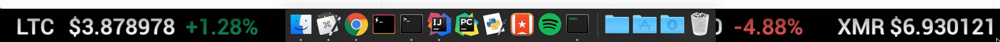

# Cryptobox
A realtime cryptocurrency market dashboard.


Currently supported markets are Bitcoin/USD, Ethereum/USD, Litecoin/USD, Monero/USD, and Dash/USD.

## Installation

You can download the latest release [here][1] (MacOS only at the moment).

Or, if you would like to build the source yourself, simply:
```
$ go get github.com/hxnt/cryptobox
```

## Usage

Cryptobox is intended to be used on MacOS, specifically behind the dock.

Like this:


## Still To Do

1. Add the option to show/hide select specific markets.
2. Add more market options.
3. Make more customizable.

## License

[MIT License](LICENSE.md) © Austin Wade

[1]: https://github.com/austinwade/cryptobox/releases
